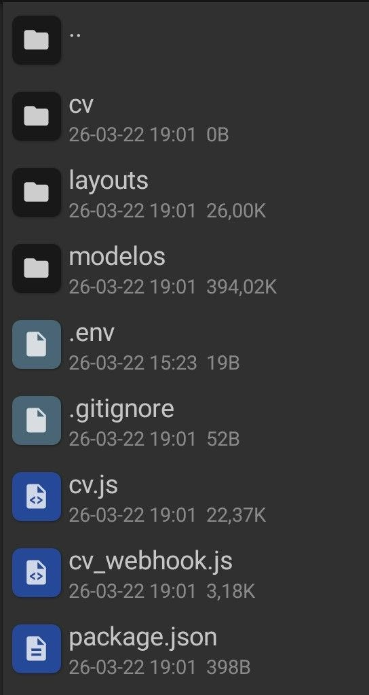
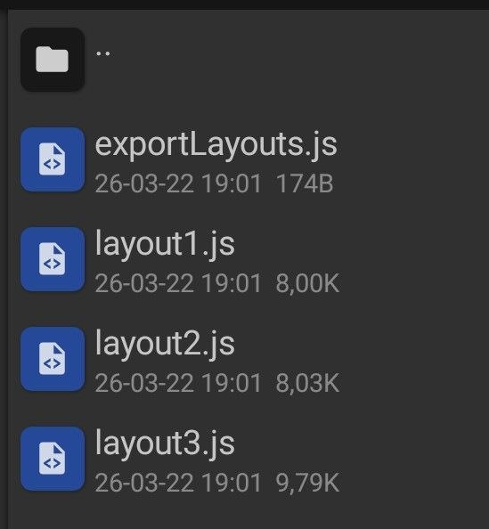
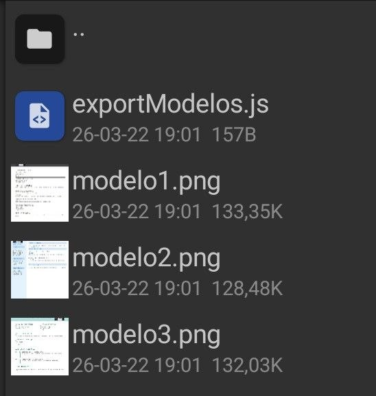

# Bot Currículo WhatsApp

Bot para geração de currículos profissionais via WhatsApp com pagamento via Pix — rodando em VPS Linux Ubuntu 22.

## Funcionalidades

- 3 modelos de currículo em PDF
- Pagamento via Pix pelo Mercado Pago
- Confirmação automática do pagamento a cada 15 segundos
- Geração do PDF e envio direto no WhatsApp após confirmação
- Foto opcional no currículo
- Currículos salvos temporariamente na pasta `cv/`

## Modelos de Currículo

| Modelo 1 — Clássico | Modelo 2 — Moderno | Modelo 3 — Destaque |
|---|---|---|
| Cinza escuro • Barra superior | Azul • Barra lateral | Verde esmeralda • Timeline |

## Estrutura do Projeto

### Raiz



### Pasta layouts/



### Pasta modelos/



## Fluxo completo

```
1. Usuário envia mensagem → Bot exibe o menu principal
2. Usuário escolhe "Gerar Currículo"
3. Bot envia previews dos 3 modelos (modelo1.png, modelo2.png, modelo3.png)
4. Usuário escolhe o modelo (M1, M2 ou M3)
5. Bot coleta os dados passo a passo:
   - Nome completo
   - Endereço
   - Telefone
   - E-mail
   - CNH (opcional)
   - Data de nascimento
   - Estado civil
   - Formação educacional (múltiplas, separadas por Enter)
   - Objetivo profissional
   - Experiência profissional (múltiplas, separadas por Enter)
   - Cursos de qualificação (um por linha)
   - Perfil profissional
   - Foto (opcional — enviada diretamente no WhatsApp)
6. Bot gera o pagamento Pix via Mercado Pago e envia:
   - QR Code
   - Código copia e cola
   - Data de expiração
7. Bot verifica o pagamento automaticamente a cada 15 segundos
8. Pagamento confirmado → Bot gera o PDF com o layout escolhido
9. PDF salvo na pasta cv/ e enviado ao usuário no WhatsApp
10. Arquivos temporários (foto e PDF) são deletados após o envio
```

## Comandos disponíveis no WhatsApp

| Comando | Descrição |
|---------|-----------|
| `menu` | Reinicia o fluxo do zero |
| `status` | Verifica o status do pagamento atual |
| `cancelar` | Cancela o processo e limpa os dados |
| `feedback` | Envia um feedback sobre o serviço |

## Estrutura de Arquivos

```
/
├── cv.js                ← Bot principal (lógica e fluxo de mensagens)
├── cv_webhook.js        ← Integração com a API do Mercado Pago
├── .env.example         ← Modelo das variáveis de ambiente
├── package.json         ← Dependências do projeto
├── .gitignore
├── layouts/
│   ├── layout1.js       ← Modelo 1: cinza escuro com barra superior
│   ├── layout2.js       ← Modelo 2: azul com barra lateral
│   ├── layout3.js       ← Modelo 3: verde esmeralda com timeline
│   └── exportLayouts.js ← Exporta todos os layouts
├── modelos/
│   ├── modelo1.png      ← Preview do layout 1
│   ├── modelo2.png      ← Preview do layout 2
│   ├── modelo3.png      ← Preview do layout 3
│   └── exportModelos.js ← Exporta os caminhos dos previews
├── imagens/
│   ├── estrutura-raiz.png   ← Screenshot da estrutura raiz
│   ├── pasta-layouts.png    ← Screenshot da pasta layouts
│   └── pasta-modelos.png    ← Screenshot da pasta modelos
└── cv/                  ← Pasta onde os PDFs e fotos são salvos temporariamente
```

## Requisitos

- Node.js 22+
- VPS Linux Ubuntu 22
- Conta no Mercado Pago com token de produção
- Número de WhatsApp exclusivo para o bot

## Setup

### 1. Clonar o repositório

```bash
git clone https://github.com/seu-usuario/bot-curriculo-whatsapp.git
cd bot-curriculo-whatsapp
```

### 2. Instalar dependências

```bash
npm install
```

### 3. Configurar variáveis de ambiente

```bash
cp .env.example .env
nano .env
```

Preencha com seu token do Mercado Pago:

```env
MERCADO_PAGO_TOKEN=seu_token_aqui
```

### 4. Criar a pasta de currículos

```bash
mkdir -p cv
```

### 5. Rodar o bot

```bash
node cv.js
```

Na primeira execução, um QR Code será exibido no terminal. Escaneie com o WhatsApp do número que vai usar como bot.

## Rodando em produção na VPS

Para manter o bot rodando em segundo plano, use o PM2:

```bash
# Instalar PM2
npm install -g pm2

# Iniciar o bot
pm2 start cv.js --name bot-curriculo

# Salvar para reiniciar automaticamente após reboot
pm2 save
pm2 startup
```

### Comandos úteis do PM2

```bash
pm2 status              # Ver status do bot
pm2 logs bot-curriculo  # Ver logs em tempo real
pm2 restart bot-curriculo
pm2 stop bot-curriculo
```

## Dependências

| Pacote | Uso |
|--------|-----|
| `whatsapp-web.js` | Conexão com o WhatsApp |
| `qrcode-terminal` | Exibe o QR Code no terminal |
| `pdfkit` | Geração dos PDFs |
| `axios` | Chamadas à API do Mercado Pago |
| `uuid` | Geração de IDs únicos para os pagamentos |
| `dotenv` | Leitura das variáveis de ambiente |
